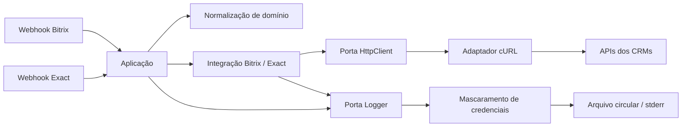

# Arquitetura

Quero manter esta integração pequena e compreensível. Separei as decisões do fluxo comercial dos efeitos de rede e de escrita, mantendo visíveis os contratos herdados dos CRMs.

## Caminho das dependências

As setas mostram o caminho de uma execução. No código, os clientes recebem as interfaces das portas. O `bootstrap.php` e a `Application/Factory` escolhem e montam os adaptadores concretos.

| Parte | Responsabilidade | Fronteira |
|---|---|---|
| Entradas HTTP | Ler query/body e chamar o fluxo correspondente. | Não montam clientes ou credenciais. |
| `Application` | Decidir a sequência de consultas e alterações. | Usa clientes de integração e a porta de logs. |
| `Domain/Normalizer` | Normalizar e-mail, nome e valores de enumerações. | Não acessa rede, arquivos ou ambiente. |
| `Integration` | Traduzir campos e operações de cada CRM. | Recebe a porta HTTP por construtor. |
| `Ports` | Definir como enviar uma requisição e registrar um evento. | Não depende de cURL ou de arquivos. |
| `Adapters` | Executar HTTP e escrever no destino escolhido. | Concentra os efeitos externos. |
| `Configuration` e `config/` | Carregar ambiente, validar opções e fornecer os mapeamentos. | Configuração privada pode ficar fora do Git. |

`Integration/Bitrix` e `Integration/Exact` conhecem o formato dos fornecedores: são traduções de contrato, não entidades do domínio. A aplicação ainda depende desses clientes concretos. A separação por portas foi aplicada onde permite substituir os efeitos externos e testar os fluxos sem ampliar a estrutura desnecessariamente.

## Vocabulário compartilhado

| Conceito | Significado no projeto |
|---|---|
| Lead | Oportunidade em qualificação. Seu ID Bitrix e seu ID Exact são identidades diferentes. |
| Contato | Pessoa vinculada ao negócio no Bitrix; o ID Exact ajuda a localizar um contato existente. |
| Negócio | Oportunidade comercial do Bitrix, associada a contato, categoria e estágio. |
| Conta | Segmento da Exact que seleciona a credencial correspondente. |
| Evento | Gatilho recebido, como agendamento, reagendamento, qualificação, ganho ou perda. |
| Categoria | Pipeline do negócio no Bitrix. |
| Estágio | Posição do negócio ou do lead no fluxo do respectivo CRM. |
| Origem e suborigem | Canal de aquisição traduzido conforme a conta e a origem Bitrix. |
| Campo personalizado | Identificador usado pelo CRM para armazenar informações adicionais ou relacionar registros. |
| Mapeamento | Correspondência explícita entre valores, campos e estágios dos dois sistemas. |

Essa é a ontologia usada aqui: nomes com significado definido e relações que aparecem no código. Uma conta não é um estágio, e o mesmo número em dois CRMs não representa necessariamente a mesma entidade.

## Decisões

**Composição explícita.** A factory recebe a configuração e constrói os clientes e fluxos. Não há registro global de serviços, container de dependências ou herança de controllers.

**Contratos preservados.** Mantive as rotas, nomes de campos, IDs e ordem das chamadas cobertas pela referência. A normalização que já existia também faz parte desse contrato. Alterações de regra precisam de cenários que mostrem o antes e o depois.

**Configuração separada.** Tokens, URL autenticada, opções operacionais e caminho do mapeamento privado vêm do ambiente. IDs e enumerações de referência continuam em arquivos de configuração legíveis. Arquivos `config/*.local.*` são privados e ignorados.

**Objetos pequenos onde ajudam.** `Request` representa uma requisição; `Rotation` representa a política de retenção; cada adaptador executa um efeito. Não criei uma classe para cada campo do CRM. Alguns contratos recebem vários parâmetros para representar os campos exigidos pela operação.

**Logs atrás de uma porta.** O fluxo escreve por `Logger`; um decorador mascara credenciais antes de enviar ao arquivo circular ou `stderr`. O registro de eventos na lista do Bitrix é uma operação de integração separada e permanece no fluxo original.

**Namespace.** O código usa `CrossHub`.

## Princípios aplicados

Object Calisthenics orienta coesão, dependências explícitas, valores sem setters e extração de responsabilidades. Não tratei o exercício como uma lista rígida que obrigasse a multiplicar objetos ou alterar contratos.

Dos 12 fatores, apliquei [configuração por ambiente](https://12factor.net/config), [dependências explícitas](https://12factor.net/dependencies) e a opção de [logs como fluxo de eventos](https://12factor.net/logs). O modo de arquivo circular preserva a operação existente. O projeto não declara conformidade integral com os 12 fatores.

## Limites assumidos

O processamento é síncrono e os contratos de entrada dependem dos mapeamentos da instalação. Não há persistência própria para idempotência, fila, política automática de repetição ou validação própria de assinatura dos webhooks. A autenticação e a exposição do endpoint precisam ser avaliadas no ambiente de implantação.

Os testes substituem a rede por gravação de requisições e respostas programadas. Testes de cURL e do roteador usam servidores locais. Isso permite verificar o contrato conhecido, mas não comprova o comportamento atual das APIs em produção.
